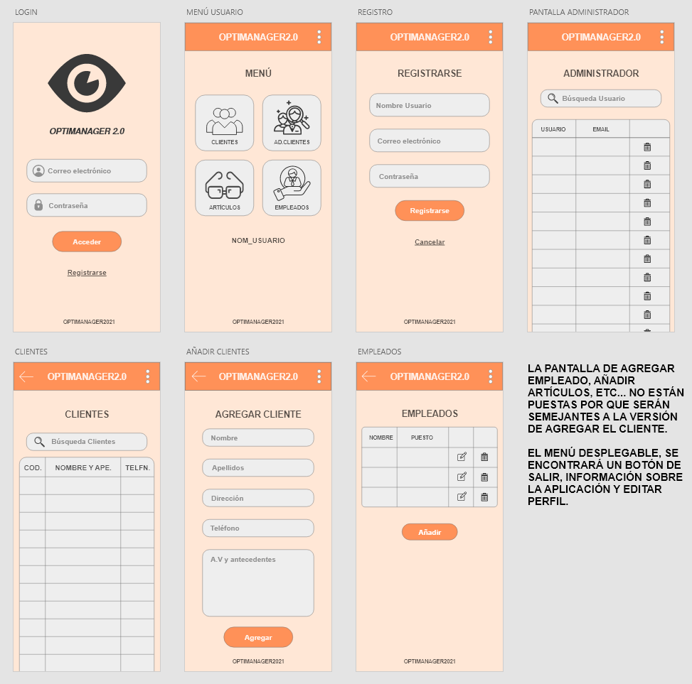

# OptiManager 2.0
Aplicación desarrollada para proyecto final de ciclo de **Desarrollo de Aplicaciones Multiplataforma**

## BREVE DESCRIPCIÓN APP
Aplicación de gestión para ópticas.  
Consiste en una App que nos permita gestionar todo lo relacionado con una óptica, como pueden ser los clientes, los artículos y los empleados.  
Me baso en esta App por mi experiencia laboral en el mundo de la óptica, y porque creo que puede ser de utilidad ya que agilizaría el proceso de añadir nuevos clientes, artículos, y llevar un control mas exhaustivo de los empleados.  
Decimos que agilizaría el proceso ya que no tendríamos que dirigirnos a un ordenador de escritorio, y directamente con un smartphone o una tablet tendríamos un trato más directo con el cliente y nos resultaría más sencillo ir agregando información sobre el mismo, durante el muestreo de artículos como en la toma de medidas dentro de un gabinete óptico.  

## ¿A quién va dirigida la aplicación?
Esta aplicación va dirigida para las empresas ópticas, ya que les será de más utilidad poder ir agregando clientes a una lista a través de una APP y recoger toda la información de cada cliente, en vez de utilizar el clásico papel y bolígrafo, con la posibilidad de que los datos de los clientes con el tiempo se extravíen y a la hora de buscar el documento de datos del cliente nos resulte más complicado.  
Actualmente se utilizan muchas aplicaciones de escritorio, pero creo que sería buena idea crear una aplicación para móviles y tablets. 
Sería buena idea esta APP, porque al empleado le daría la total libertad de ir presentándole al cliente los productos de la óptica (monturas, tipos de lentes, etc...) e ir anotando los gustos o necesidades de cada uno de ellos a través de un móvil o tablet.

## TECNOLOGÍA EMPLEADA 
<strong> IONIC </strong>

## DISEÑO/MOCKUP DE LA APLICACIÓN
  
**La imagen puede no representar el resultado final. Pueden haber cambios durante el desarrollo.**
----------------------------------

## OBJETIVOS DEL PROYECTO
- Pantalla de inicio con Login de acceso y Registro para cada una de las ópticas.
- Acceso con una cuenta de administrador para comprobación de funcionamiento correcto y eliminación de cuentas falsas.
- Botones en una pantalla menú en la que acceder a Clientes, Nuevo Cliente, Listado de Artículos, Empleados.
- Es una versión 2.0 ya que en el 1er año de ciclo hice un CRUD con la idea de hacer una app de gestión para ópticas muy básica. [Enlace a CRUD](https://github.com/Miguelgm1693/CRUD_OptiManager).
- Su finalidad es agilizar el trabajo de los empleados para perder el menor tiempo posible a la hora de añadir clientes, artículos o toma de medidas.
- Lo que quiero conseguir con esta app es tener un trato más cercano de cara al cliente.
- Para el botón de clientes, aparecerá un listado con todos los clientes que se hayan agregado, y tendremos una opción de búsqueda por CodCliente o por Nombre y apellidos.
- El registro de clientes será con su nombre, apellidos, dirección, teléfono, antecedentes visuales... El CodCliente se generará automáticamente cada vez que vayamos agregando un cliente nuevo.
- Para los artículos si podremos modificar el código de artículo para que la búsqueda de los artículos sea de manera más sencilla, ya que con unas siglas podamos buscarlo.
- En el caso de empleados registraremos el nombre, apellidos, dirección, correo electrónico, DNI, puesto que ocupa, titulación, años en la empresa, salario.
- En la base de datos registraremos los usuarios, los clientes, los artículos y los empleados.
  - BD Clientes --> CodCliente, NomCliente, ApeCliente, DirCliente, TelCliente, AVCliente.
  - BD Artículos --> Id, CodArt, NomArt, PVOArt, PVPArt.
  - BD Empleados --> CodEmple, NomEmple, ApeEmple, DNIEmple, EmaEmple, PuesEmple, TitEmple, AnyoEmple, SalEmple.
  - BD Usuarios --> CodUsu, NomUsu, PassUsu.

## DIARIO SEMANAL
### Semana 1 (1-7 Noviembre)
- Título del proyecto y descripción sobre la aplicación.
- Tecnología que vamos a utilizar y objetivos.
- Actualización del README

### Semana 2 (8-14 Noviembre)
- Realización del Mockup de la aplicación.

### Semana 3 (15-21 Noviembre)
- Entrega anteproyecto para revisión y comenzar proyecto.

## COMPLETADO
- [X] Descripción, título y objetivos de la App
- [X] Hacer mockup de la aplicación
- [ ] Subir código fuente de la App
- [ ] PDF explicativo de la App
- [ ] Tutorial de uso de la App con capturas
- [ ] Subida de video con explicación de la App
